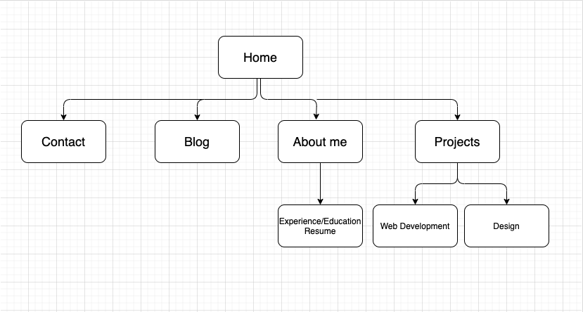

# T1A2 - Portfolio
Portfolio Assignment

# Published website
https://johnnsonkp-portfolio.netlify.app

# Github repo
https://github.com/Johnnsonkp/Portfolio

# Portfolio website description
This is my portfolio for the T1A2 Assignment 

# Purpose
This portfolio is to meet the requirements of my assignment as well as to have an online website/platform to showcase my work, skills, attributes, interests and resume to any future employers.

# Functionality/features
* Responsive on mobile, ipad and desktop devices
* Includes a home, about, portfolio, blog and, contact page
* Includes a downloadable resume in pdf format
* Includes my skills 
* Includes all my current projects 
* Includes links to all my socials

# Sitemap

# Screenshots

* Web version (home page)

* Mobile version (home page)

# Target Audience 
The main target audience is to the markers of my portfolio assignment as well as any potential future employers.

# Tech stack
HTML, CSS, SCSS, font-awesome & Netlify